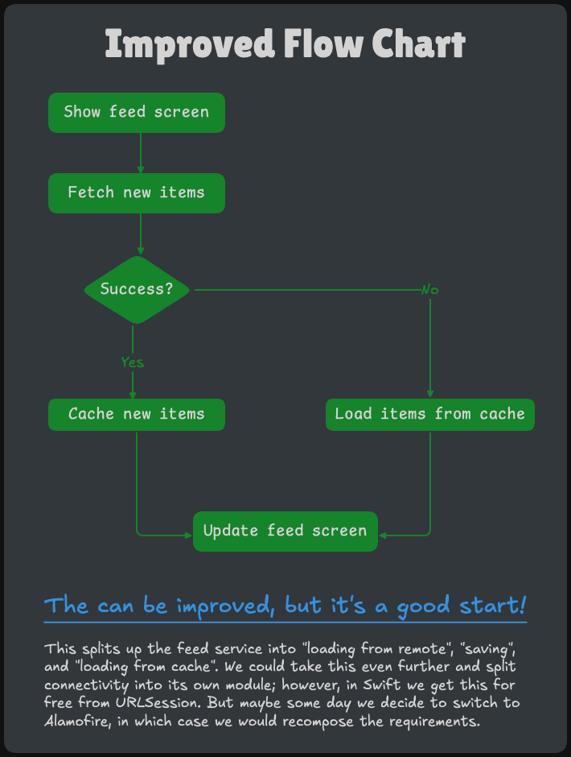
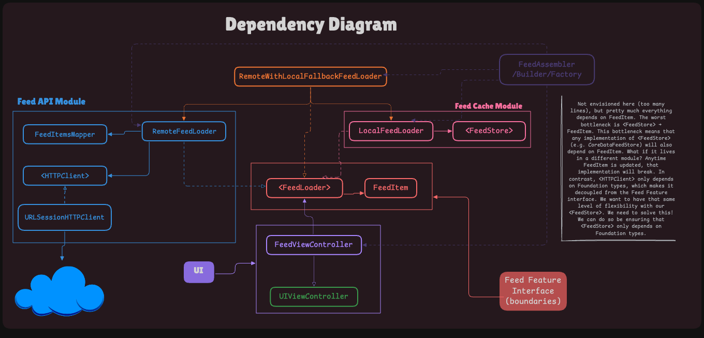

# essential-feed-case-study

[](https://github.com/webdavis/essential-feed-case-study/actions/workflows/CI.yml)

A case study of a feed-based iOS app.

## Requirements

### Story: Customer requests to see their image feed

### Narrative #1

```
As an online customer
I want the app to automatically load my latest image feed
So I can always enjoy the newest images of my friends
```

#### Scenarios (Acceptance criteria)

```
Given the customer has connectivity
 When the customer requests to see their feed
 Then the app should display the latest feed from remote
  And replace the cache with the new feed
```

### Narrative #2

```
As an offline customer
I want the app to show the latest saved version of my image feed
So I can always enjoy images of my friends
```

#### Scenarios (Acceptance criteria)

```
Given the customer doesn't have connectivity
  And there’s a cached version of the feed
  And the cache is less than seven days old
 When the customer requests to see the feed
 Then the app should display the latest saved feed

Given the customer doesn't have connectivity
  And there’s a cached version of the feed
  And the cache is seven days old or more
 When the customer requests to see the feed
 Then the app should display an error message

Given the customer doesn't have connectivity
  And the cache is empty
 When the customer requests to see the feed
 Then the app should display an error message
```

## Use Cases

### Load Feed From Remote Use Case

#### Data:

- URL

#### Primary course (happy path):

1. [x] Execute "Load Feed Items" command with above data.
1. [x] System passes message in order to download data from the URL.
1. System downloads data from the URL.
1. System validates downloaded data.
1. System creates feed items from valid data.
1. System delivers feed items.

#### Invalid data – error course (sad path):

1. System delivers invalid data error.

#### No connectivity – error course (sad path):

1. System delivers connectivity error.

______________________________________________________________________

### Load Feed From Cache Use Case

#### Primary course:

1. Execute "Load Feed Items" command with above data.
1. System fetches feed data from cache.
1. System validates cache is less than seven days old.
1. System creates feed items from cached data.
1. System delivers feed items.

#### Error course (sad path):

1. System delivers error.

#### Expired cache course (sad path):

1. System deletes cache.
1. System delivers no feed items.

#### Empty cache course (sad path):

1. System delivers no feed items.

______________________________________________________________________

### Cache Feed Use Case

#### Data:

- Feed items

#### Primary course (happy path):

1. Execute "Save Feed Items" command with above data.
1. System deletes old cache data.
1. System encodes feed items.
1. System timestamps the new cache.
1. System saves new cache data.
1. System delivers success message.

#### Deleting error course (sad path):

1. System delivers error.

#### Saving error course (sad path):

1. System delivers error.

## Flowchart



## Model Specs

### Feed Image

| Property      | Type                |
| ------------- | ------------------- |
| `id`          | `UUID`              |
| `description` | `String` (optional) |
| `location`    | `String` (optional) |
| `imageURL`    | `URL`               |

### Payload contract

```
GET *url* (TBD)

200 RESPONSE

{
	"items": [
		{
			"id": "a UUID",
			"description": "a description",
			"location": "a location",
			"image": "https://a-image.url",
		},
		{
			"id": "another UUID",
			"description": "another description",
			"image": "https://another-image.url"
		},
		{
			"id": "even another UUID",
			"location": "even another location",
			"image": "https://even-another-image.url"
		},
		{
			"id": "yet another UUID",
			"image": "https://yet-another-image.url"
		}
		...
	]
}
```

## App Architecture/Dependency Diagram


